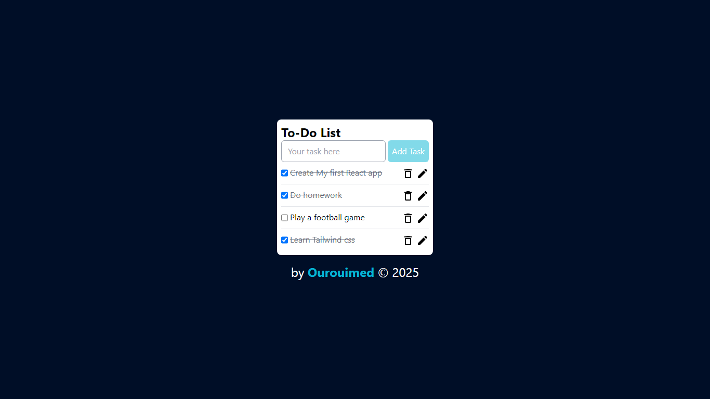

# React js To do list Application
This is my first REACT js Application , it's a to do list app 

## Features
- Add tasks 
- Update and Remove tasks
- Check Completed tasks
- Save tasks and their status (if completed or not) to user browser local storage
## Installation
1  - Clone this repositiry to your device
```bash
git clone https://github.com/Ourouimed/React-todo.git
cd React-todo
```
2 - Install dependencies:
```bash
npm install
```

3 - run App 
```bash 
npm start
```

## Dependencies
- Node js 
- React js
- Tailwind css 
- Material UI icons

## Live preview & screenshots

<h3>For live Preview <a href="https://ourouimed.github.io/React-todo">Click here</a></h3>

## Folder structure
``` 
react-todo
├── build
├── node_modules
├── public
│   └── index.html
├── src
│   ├── App.js         # Main application file
│   ├── index.css      # Styling for the application
│   ├── index.js       # Entry point of the application
│   ├── reportWebVitals.js
│   └── setupTests.js
├── .gitignore         # Ignored files for Git
├── package-lock.json  # Package lock file
├── package.json       # Project metadata and dependencies
├── README.md          # Project documentation (this file)
└── tailwind.config.js # Tailwind CSS configuration
```